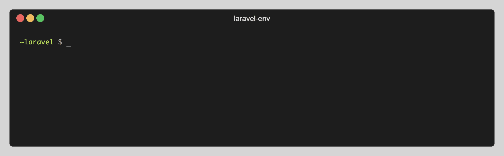

[](https://github.com/msztorc/laravel-env/actions)
[](https://travis-ci.org/msztorc/laravel-env)
[](https://scrutinizer-ci.com/g/msztorc/laravel-env)
[](https://packagist.org/packages/msztorc/laravel-env)
[](https://packagist.org/packages/msztorc/laravel-env)
[](LICENSE.md)

# Laravel-Env
Managing environment variables programmatically and from the command line (by the artisan)



<!-- TOC -->
- [Installation](#installation)
- [Usage](#usage)
- [API Reference](#api-reference)
- [Contributing](#contributing)
- [Credits](#credits)
- [License](#license)

<!-- /TOC -->

## Installation

You can install the package via composer:

```bash
composer require msztorc/laravel-env
```


## Usage

### `env:get` - Getting environment variable value

**CLI by Artisan**

`php artisan env:get VAR_KEY`


Get value only

```bash
$ php artisan env:get APP_NAME
Laravel
```

Get key-value

```bash
$ php artisan env:get APP_NAME --key-value
APP_NAME=Laravel
```

Get key-value as JSON output

```bash
$ php artisan env:get APP_NAME --json
{"APP_NAME":"Laravel"}
```

Print all env variables as JSON output

```bash
$ php artisan env:get --json
{"APP_NAME":"Laravel","APP_ENV":"local","APP_KEY":"","APP_DEBUG":"true","APP_URL":"http:\/\/localhost","LOG_CHANNEL":"stack","DB_CONNECTION":"mysql","DB_HOST":"127.0.0.1","DB_PORT":"3306","DB_DATABASE":"laravel","DB_USERNAME":"root","DB_PASSWORD":"","BROADCAST_DRIVER":"log","CACHE_DRIVER":"file","QUEUE_CONNECTION":"sync","SESSION_DRIVER":"file","SESSION_LIFETIME":"120","REDIS_HOST":"127.0.0.1","REDIS_PASSWORD":"null","REDIS_PORT":"6379","MAIL_MAILER":"smtp","MAIL_HOST":"smtp.mailtrap.io","MAIL_PORT":"2525","MAIL_USERNAME":"null","MAIL_PASSWORD":"null","MAIL_ENCRYPTION":"null","MAIL_FROM_ADDRESS":"null","MAIL_FROM_NAME":"${APP_NAME}","AWS_ACCESS_KEY_ID":"","AWS_SECRET_ACCESS_KEY":"","AWS_DEFAULT_REGION":"us-east-1","AWS_BUCKET":"","PUSHER_APP_ID":"","PUSHER_APP_KEY":"","PUSHER_APP_SECRET":"","PUSHER_APP_CLUSTER":"mt1","MIX_PUSHER_APP_KEY":"${PUSHER_APP_KEY}","MIX_PUSHER_APP_CLUSTER":"${PUSHER_APP_CLUSTER}"}

```

**Programmatically**

```php
<?php

use msztorc\LaravelEnv\Env;

$env = new Env();
$val = $env->getValue('APP_NAME');

echo $val; // Laravel

```


### `env:set` - Setting environment variable value

**CLI by Artisan**

`php artisan env:set KEY VALUE` or `php artisan env:set KEY=VALUE` or `php artisan env:set KEY "VALUE WITH SPACES"`


Set value variants

```bash
$ php artisan env:set DB_HOST 10.10.10.10
Environment variable with key 'DB_HOST' has been set to '10.10.10.10'
```

```bash
$ php artisan env:set MAIL_HOST=smtp.mydomain.com
Environment variable with key 'MAIL_HOST' has been set to 'smtp.mydomain.com'
```

_Setting a value containing spaces_

```bash
$ php artisan env:set APP_NAME "Laravel App"
Environment variable with key 'APP_NAME' has been set to 'Laravel App'
```

**Programmatically**

```php
<?php

use msztorc\LaravelEnv\Env;

$env = new Env();
$val = $env->setValue('APP_NAME', 'Laravel App');

echo $val; // Laravel App

```


### `env:del` - Deleting environment variable

**CLI by Artisan**

`php artisan env:del VAR_KEY`


```bash
$ php artisan env:del PUSHER_APP_ID
Variable 'PUSHER_APP_ID' has been deleted
```

**Programmatically**

```php
<?php

use msztorc\LaravelEnv\Env;

$env = new Env();
$env->deleteVariable('PUSHER_APP_ID');

```


### `env:list` - List all environments variables

```bash
$ php artisan env:list
APP_NAME=Laravel
APP_ENV=local
APP_KEY=
APP_DEBUG=true
APP_URL=http://localhost

LOG_CHANNEL=stack

DB_CONNECTION=mysql
DB_HOST=127.0.0.1
DB_PORT=3306
DB_DATABASE=laravel
DB_USERNAME=root
DB_PASSWORD=

BROADCAST_DRIVER=log
CACHE_DRIVER=file
QUEUE_CONNECTION=sync
SESSION_DRIVER=file
SESSION_LIFETIME=120

REDIS_HOST=127.0.0.1
REDIS_PASSWORD=null
REDIS_PORT=6379

MAIL_MAILER=smtp
MAIL_HOST=smtp.mailtrap.io
MAIL_PORT=2525
MAIL_USERNAME=null
MAIL_PASSWORD=null
MAIL_ENCRYPTION=null
MAIL_FROM_ADDRESS=null
MAIL_FROM_NAME="${APP_NAME}"

AWS_ACCESS_KEY_ID=
AWS_SECRET_ACCESS_KEY=
AWS_DEFAULT_REGION=us-east-1
AWS_BUCKET=

PUSHER_APP_ID=
PUSHER_APP_KEY=
PUSHER_APP_SECRET=
PUSHER_APP_CLUSTER=mt1

MIX_PUSHER_APP_KEY="${PUSHER_APP_KEY}"
MIX_PUSHER_APP_CLUSTER="${PUSHER_APP_CLUSTER}"

```

Print all env variables as JSON output

```bash
$ php artisan env:list --json
{"APP_NAME":"Laravel","APP_ENV":"local","APP_KEY":"","APP_DEBUG":"true","APP_URL":"http:\/\/localhost","LOG_CHANNEL":"stack","DB_CONNECTION":"mysql","DB_HOST":"127.0.0.1","DB_PORT":"3306","DB_DATABASE":"laravel","DB_USERNAME":"root","DB_PASSWORD":"","BROADCAST_DRIVER":"log","CACHE_DRIVER":"file","QUEUE_CONNECTION":"sync","SESSION_DRIVER":"file","SESSION_LIFETIME":"120","REDIS_HOST":"127.0.0.1","REDIS_PASSWORD":"null","REDIS_PORT":"6379","MAIL_MAILER":"smtp","MAIL_HOST":"smtp.mailtrap.io","MAIL_PORT":"2525","MAIL_USERNAME":"null","MAIL_PASSWORD":"null","MAIL_ENCRYPTION":"null","MAIL_FROM_ADDRESS":"null","MAIL_FROM_NAME":"${APP_NAME}","AWS_ACCESS_KEY_ID":"","AWS_SECRET_ACCESS_KEY":"","AWS_DEFAULT_REGION":"us-east-1","AWS_BUCKET":"","PUSHER_APP_ID":"","PUSHER_APP_KEY":"","PUSHER_APP_SECRET":"","PUSHER_APP_CLUSTER":"mt1","MIX_PUSHER_APP_KEY":"${PUSHER_APP_KEY}","MIX_PUSHER_APP_CLUSTER":"${PUSHER_APP_CLUSTER}"}

```


### Testing

``` bash
composer test
```


## API Reference

### Methods

Check if the variable exists

```exists(string $key): bool```

**Params**

_string_ **$key** Environment variable key


Get the current env variable value

```getValue(string $key): string```

**Params**

_string_ **$key** Environment variable key


Get env key-value

```getKeyValue(string $key): array```

**Params**

_string_ **$key** Environment variable key


Set env variable value

```setValue(string $key, string $value, $write = true): string```

**Params**

_string_ **$key** Environment variable key
_string_ **$value** Variable value
_bool_ **$write** Write changes to .env file (default=true)


Delete environment variable

```deleteVariable(string $key, bool $write = true): bool```

**Params**

_string_ **$key** Environment variable key
_bool_ **$write** Write changes to .env file (default=true)


Get all env variables from memory

```getVariables(): array```


Get current env entire config from memory

```getEnvContent(): string```


Write env config to file

```write(): bool```


Check if the changes has been saved

```isSaved(): bool```

Check if there were any env content changes

```wasChanged(): bool```


## Contributing

Please see [CONTRIBUTING](CONTRIBUTING.md) for details.


## Credits

- [Miroslaw Sztorc](https://github.com/msztorc)
- [All Contributors](../../contributors)

## License

The MIT License (MIT). Please see [License File](LICENSE.md) for more information.
